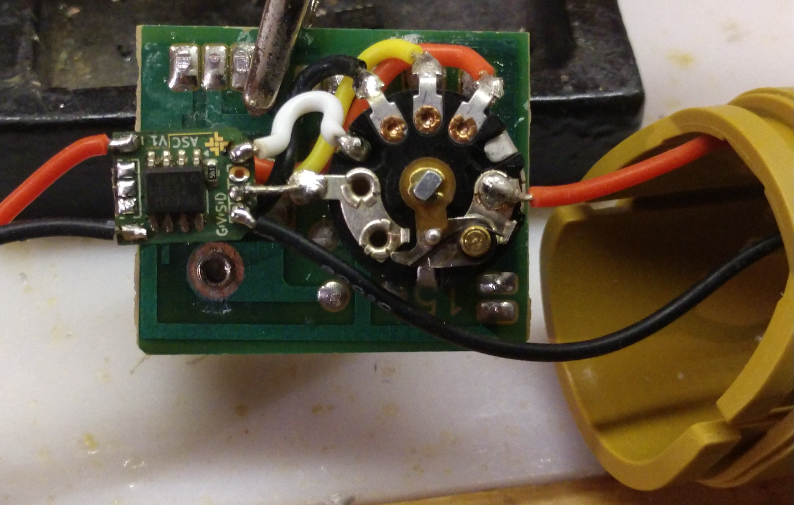
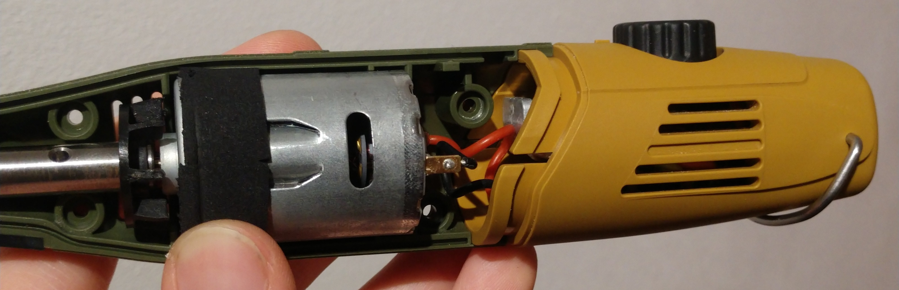

# ASC as Speed Controller (for Proxxon Mircomot)

@Tristan Wieczorek    15.03.2026

This is a subproject within the overall initiative to use the [ASC](https://github.com/MaBaTa/Advanced-Servo-Controller) as an speed controller for a Proxxon rotary tool. *(Yes, i found annother alternative usecase for this Board before finishing the primary software)*

### Motivation:

A while back i converted a new Proxxon Mircomot to USB-C PD to satisfy my PD addiction. The Problem with this conversion was that the original speed control of this rotary tool needs some kind of non-stable power supply i.e. transformator to work. so after that it would run at 100% all the time. That was ok-ish since you could use a 12V PD or a 5V non PD supply to run it slower, but eventually i realized i could use my ASC PCB to solve this problem the easy way. Spoiler alert: it wasn't.

### RPM Control:

Since a DC motor is slowing down under load, and it would be ideal if this wouldn't happen in a rotary tool, i searched for a way to compensate this behaviour.

The ideal solution would be an [IR compensation (Arduino Forum)](https://forum.arduino.cc/t/running-dc-motor-at-constant-speed-by-measuring-current/1362224/38) since the DRV8231A on the ASC already provides current measurement. This does [calculate](https://industrialmonitordirect.com/de/blogs/knowledgebase/resolving-dc-motor-speed-regulation-with-ir-compensation) the the needed voltage to hold a desired RPM from the measured current an a few hardware related constances. This is a truly interesting topic in its own right, but unfortunately, it turned out not to be suitable for this purpose.

### Hardware Modification:

In my case i solderd the ASC on top of the original PCB, so it still holds the potentiometer in its place.

The power supply goes through the switch of the potentiometer, so it turns everything off. The potentiometer itself is connected to the corresponding pins of the ASC and the motor is connected to the motor pins. Very simple so far. The white wire is optional to enable firmware uploads through the potentiometer shaft via UPDI.

When assembling, the whole thing should look something like this:

